# Linked List

## Terminologi

Sebelum masuk kepada definisi, terdapat istilah yang sering digunakan dalam mendeskripsikan linked list.

- **Node** – Sebuah node merepresentasikan satu elemen data yang dapat berisi nilai dan/atau informasi lain yang dibutuhkan serta terdapat hubungan atau link/_reference_ ke node lain.
- **Head** – merupakan node pertama/paling depan dari linked list.
- **Tail** – merupakan node terakhir/paling belakang dari linked list.

## Definisi

**Linked List** adalah struktur data yang menyimpan data dalam bentuk linear, dimana tiap-tiap data direpresentasikan oleh node-node yang membentuk sekuens secara berurutan. Pada dasarnya, satu node dalam linked list terdiri dari:

- Data yang disimpan, dan
- Referensi (link) kepada node selanjutnya

Contoh ilustrasi sebuah node dalam linked list.

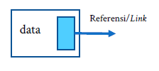

**Karakteristik**

Linked list merupakan struktur data yang bersifat **dinamis**, yang artinya ukurannya dapat berubah mengikuti banyaknya data yang dimasukkan/ditambahkan, tidak seperti Static Array. Namun, data pada linked list tidak bisa diakses secara random layaknya pengaksesan indeks pada array, melainkan harus melalui proses traversing terlebih dahulu.

## Ilustrasi

Linked list dapat diilustrasikan sebagai kumpulan node yang saling terhubung secara sekuensial membentuk rangkaian secara berurutan. Misalkan, terdapat list 𝐴 dengan kumpulan data 𝐴 = [2,3,6,11,13].

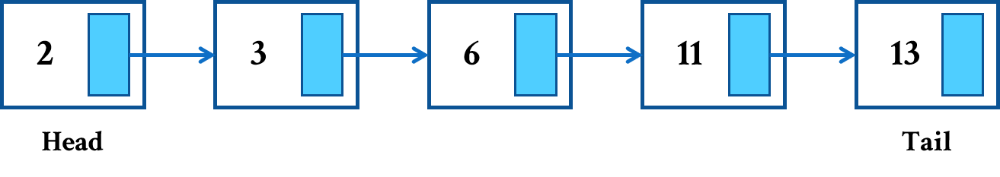

## Operasi Dasar

- **isEmpty** - untuk memeriksa apakah list kosong atau tidak.
- **pushBack** - operasi untuk menambahkan data baru dari belakang list.

    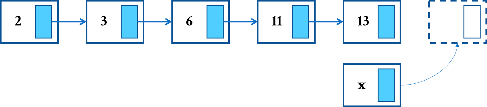

- **pushFront** - operasi untuk menambahkan data baru dari depan list.

    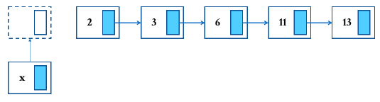

- **insertAt** - operasi untuk menambahkan data baru pada posisi yang diinginkan.

    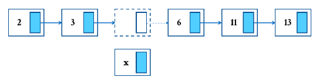

- **back** - untuk memperoleh data yang berada pada paling belakang.

- **front** - untuk memperoleh data yang berada pada paling depan.

- **getAt** - untuk mendapatkan data pada posisi tertentu.

- **popBack** - operasi untuk menghapus data yang berada pada paling belakang.

    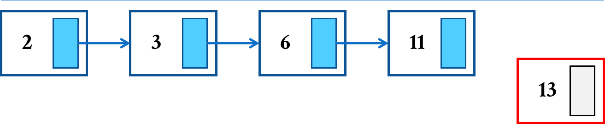

- **popFront** - operasi untuk menghapus data yang berada pada paling depan.

    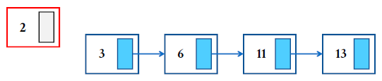

- **remove(x)** - untuk menghapus data x yang pertama muncul pada list.

    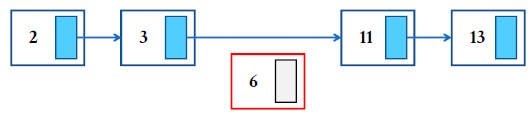


## Variasi Linked List

- ### Singly-Linked List

    Node dalam **Singly-Linked List** hanya menyimpan referensi/link kepada node selanjutnya saja. Biasanya referensi ini direpresentasikan oleh variabel **`next`**.

    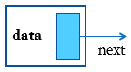

- ### Doubly-Linked List

    Pada **Doubly-Linked List**, setiap node mempunyai dua referensi/link, yakni link yang mengarah ke node selanjutnya dan node sebelumnya. Dua referensi/link ini biasa disebut dengan **`next`** dan **`prev`** (previous).

    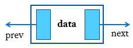


## Implementasi ADT: **`SinglyList`**

[**Link Implementasi Lengkap `SinglyList` dapat dilihat di sini**](https://github.com/AlproITS/StrukturData/)

Representasi dan Implementasi yang dijelaskan dalam modul ini adalah **Singly Linked List** yang menyimpan tipe data int. Representasi akan dibawa ke dalam bentuk Abstract Data Type (ADT) yang nantinya akan menjadi tipe data baru bernama SinglyList.

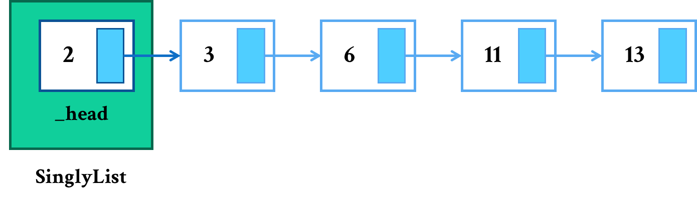

Dalam implementasi ini, kompleksitas waktunya adalah :

**Operasi**|**Keterangan**|**Kompleksitas Waktu**
-----|-----|-----
pushBack|Memasukkan data baru dari belakang.|O(N)
pushFront|Memasukkan data baru dari depan.|O(1)
insertAt|Memasukkan data baru pada posisi tertentu.|O(N) (Worst-case)
popBack|Menghapus node paling belakang.|O(N)
popFront|Menghapus node paling depan.|O(1)
remove(x)|Menghapus node pertama dengan data x.|O(N) (Worst-case)
front|Mendapatkan nilai node terdepan.|O(1)
back|Mendapatkan nilai node paling belakang.|O(N)
getAt|Mendapatkan nilai node pada posisi tertentu.|O(N) (Worst-case)
isEmpty|Memeriksa apakah list kosong.|O(1)

- ### Representasi Node

    Node direprsentasikan oleh **`struct`** bernama `SListNode` yang menyimpan variabel `data` bertipe `int` dan referensi kepada node selanjutnya `next`.
    
    

    ```c
    typedef struct snode_t {
        int data;
        struct snode_t *next;
    } SListNode;
    ```

- ### Struktur SinglyList

    ```c
    typedef struct slist_t {
        unsigned _size;
        SListNode *_head;
    } SinglyList;
    ```

- ### isEmpty

    Untuk memeriksa apakah list kosong, cukup dengan memeriksa apakah **`head`** dari list tersebut bernilai `NULL` atau tidak.

    ```c
    bool slist_isEmpty(SinglyList *list) {
        return (list->_head == NULL);
    }
    ```

- ### pushBack

    Secara umum langkah-langkah untuk melakukan **pushBack** adalah sebagai berikut.

    + Buat node baru
    + Jika list kosong, maka sudah jelas bahwa **`head`**-nya adalah node baru tadi.
    + Jika tidak kosong, telusuri hingga paling belakang, kemudian node paling belakang diarahkan kepada node baru. Penelusuran dilakukan dengan bantuan variabel temporary **`temp`**.

    ```c
    void slist_pushBack(SinglyList *list, int value)
    {
        SListNode *newNode = (SListNode*) malloc(sizeof(SListNode));
        if (newNode) {
            list->_size++;
            newNode->data = value;
            newNode->next = NULL;
            
            if (slist_isEmpty(list)) 
                list->_head = newNode;
            else {
                SListNode *temp = list->_head;
                while (temp->next != NULL) 
                    temp = temp->next;
                temp->next = newNode;
            }
        }
    }
    ```

- ### pushFront

    Untuk melakukan **pushFront**, langkah-langkahnya adalah sebagai berikut.

    + Buat node baru.
    + Jika list kosong, jadikan node baru sebagai **`head`**.
    + Jika tidak kosong, maka jelas bahwa **`next`** dari node baru adalah **`head`**.

    ```c
    void slist_pushFront(SinglyList *list, int value) 
    {
        SListNode *newNode = (SListNode*) malloc(sizeof(SListNode));
        if (newNode) {
            list->_size++;
            newNode->data = value;
            
            if (slist_isEmpty(list)) newNode->next = NULL;
            else newNode->next = list->_head;
            list->_head = newNode;
        }
    }
    ```

- ### insertAt

    Operasi **inserAt** mempunyai proses yang cukup rumit. Terdapat beberapa kasus yang harus diperhatikan.

    **Kasus 1: index 0**

    + Cukup melakukan **pushFront** dan selesai.

    **Kasus 2: index berada di akhir**

    + Cukup melakukan **pushBack** dan selesai.

    **Kasus 3: index berada di tengah**

    + Buat node baru.
    + Dengan bantuan variabel **`temp`**, lakukan penelusuran hingga mencapai posisi node berada pada `index`-1.
    + Arahkan **`next`** dari node baru menuju node selanjutnya dari node terakhir hasil penelusuran.
    + Sambungkan node hasil penelusuran menuju node baru.

    ```c
    void slist_insertAt(SinglyList *list, int index, int value)
    {
        if (slist_isEmpty(list) || index >= list->_size) {
            slist_pushBack(list, value);
            return;    
        }
        else if (index == 0) {
            slist_pushFront(list, value);
            return;
        }
        
        SListNode *newNode = (SListNode*) malloc(sizeof(SListNode));
        if (newNode) {
            SListNode *temp = list->_head;
            int _i = 0;
            
            while (temp->next != NULL && _i < index-1) {
                temp = temp->next;
                _i++;
            }
            newNode->data = value;
            newNode->next = temp->next;
            temp->next = newNode;
            list->_size++;
        }
    }
    ```

- ### back

    Cukup dengan menelusuri hingga paling akhir dan return nilainya.

    ```c
    int slist_back(SinglyList *list)
    {
        if (!slist_isEmpty(list)) {
            SListNode *temp = list->_head;
            while (temp->next != NULL) 
                temp = temp->next;
            return temp->data;
        }
        return 0;
    }
    ```

- ### front

    Manfaatkan nilai data dari **`head`**.

    ```c
    int slist_front(SinglyList *list)
    {
        if (!slist_isEmpty(list)) {
            return list->_head->data;
        }
        return 0;
    }
    ```

- ### getAt

    Untuk melakukan operasi **getAt**, caranya cukup mudah, yakni:

    + Lakukan penelusuran dengan mencatat index penelusurannya.
    + Ketika sudah mencapai index yang diinginkan, maka return nilai data yang ada pada node tersebut.

    ```c
    int slist_getAt(SinglyList *list, int index)
    {
        if (!slist_isEmpty(list)) {
            SListNode *temp = list->_head;
            int _i = 0;
            while (temp->next != NULL && _i < index) {
                temp = temp->next;
                _i++;
            }
            return temp->data;
        }
        return 0;
    }
    ```

- ### popBack

    Untuk melakukan operasi **popBack**, dapat dilakukan dengan:

    + Melakukan penelusuran dengan bantuan dua node, yakni **`nextNode`** (node selanjutnya) dan **`currNode`** (node sekarang).
    + Jika `next` dari **`currNode`** kosong, maka artinya jumlah data hanya satu. Hapus langsung node tersebut.
    + Lakukan penelusuran hingga akhir.
    + Saat sampai akhir, hilangkan referensi dari node sekarang (`currNode`).
    + Hapus node selanjutnya (`nextNode`).

    ```c
    void slist_popBack(SinglyList *list)
    {
        if (!slist_isEmpty(list)) {
            SListNode *nextNode = list->_head->next;
            SListNode *currNode = list->_head;

            if (currNode->next == NULL) {
                free(currNode);
                list->_head = NULL;
                return;
            }

            while (nextNode->next != NULL) {
                currNode = nextNode;
                nextNode = nextNode->next;
            }
            currNode->next = NULL;
            free(nextNode);
            list->_size--;
        }
    }
    ```

- ### popFront

    Operasi **popFront** dapat dilakukan dengan :

    + Tampung `head` pada variabel `temp` (temporary).
    + Mengganti **`head`** dengan referensi/next dari `head`.
    + Menghapus node `temp`.

    ```c
    void slist_popFront(SinglyList *list)
    {
        if (!slist_isEmpty(list)) {
            SListNode *temp = list->_head;
            list->_head = list->_head->next;
            free(temp);
            list->_size--;
        }
    }
    ```

- ### remove(x)

    Untuk operasi **remove(x)**, yakni menghapus data x yang pertama kali ditemukan, dapat dilakukan dengan cara berikut.

    **Kasus 1: data yang dihapus dijumpai di depan**

    + Cukup melakukan **popFront** dan selesai.

    **Kasus 2: data yang dihapus dijumpai tidak di depan**

    + Lakukan penelusuran dengan memeriksa apakah data pada node penelusuran sama dengan data yang hendak dihapus. Pada saat penelusuran, catat node sebelumnya (**`prev`**) dan node sekarang (**`temp`**).
    + Ketika menemukan datanya, berhenti.
    + Sambungkan node **`prev`** dengan `next` dari node sekarang.
    + Hapus node sekarang (`temp`).

    **Kasus 3: data tidak dijumpai**

    + Pada saat berhenti melakukan penelusuran, periksa apakah node bernilai **`NULL`**. Jika bernilai `NULL`, maka dapat dipastikan data tidak ditemukan.

    ```c
    void slist_remove(SinglyList *list, int value)
    {
        if (!slist_isEmpty(list)) {
            SListNode *temp, *prev;
            temp = list->_head;

            if (temp->data == value) {
                slist_popFront(list);
                return;
            }
            while (temp != NULL && temp->data != value) {
                prev = temp;
                temp = temp->next;
            }

            if (temp == NULL) return;
            prev->next = temp->next;
            free(temp);
            list->_size--;
        }
    }
    ```

