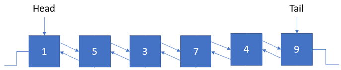

# Deque

## Terminologi

- **Head** – merupakan node pertama/paling depan dari deque.
- **Tail** – merupakan node terakhir/paling belakang dari deque.

## Definisi

Deque (Double-ended Queue) merupakan struktur data linear yang mirip dengan doubly linked list sekaligus variasi dari queue. Yang membedakan antara deque dan queue terletak pada posisi untuk menambah atau mengurangi data. Queue hanya dapat menambah data di belakang dan mengurangi data di depan, sementara deque dapat melakukan keduanya (menambah/mengurangi data di depan/belakang).

## Operasi Dasar

- **isEmpty** - untuk memeriksa apakah deque kosong atau tidak.
- **pushFront** - operasi untuk menambahkan data baru dari depan deque.
- **pushBack** - operasi untuk menambahkan data baru dari belakang deque.
- **front** - untuk memperoleh data yang berada pada paling depan.
- **back** - untuk memperoleh data yang berada pada paling belakang.
- **popFront** - operasi untuk menghapus data yang berada pada paling depan.
- **popBack** - operasi untuk menghapus data yang berada pada paling belakang.

**Kompleksitas waktu** semua operasi dilakukan secara konstan O(1).

## Aplikasi Deque

Deque umumnya digunakan untuk menyelesaikan problem dengan karakteristik **Sliding Window**. Pada problem Sliding Window, kita perlu untuk menghapus data dari depan dan belakang queue. Contoh problem Sliding Window adalah mencari nilai maksimum dari seluruh subarray dengan size tertentu.

## Implementasi ADT: `Deque`

[**Link Implementasi Lengkap `Deque` dapat dilihat di sini**](https://github.com/AlproITS/StrukturData/)



Implementasi deque dapat dilakukan dengan menggunakan **Doubly Linked List** dengan menggunakan pointer **tail/rear** untuk menunjukkan index paling belakang dan **head/front** untuk menunjukkan index terdepan pada deque.

- ### Representasi Node

    Node dari Deque direpresentasikan oleh node bernama `DListNode` yang menyimpan data int dan referensi untuk node sebelum dan selanjutnya.

    ```c
    typedef struct dnode_t {
        int data;
        struct dnode_t      \
            *next,
            *prev;
    } DListNode;
    ```

- ### Struktur Deque

    Deque memiliki dua pointer referensi pada strukturnya yaitu `head` dan `tail`.

    ```c
    typedef struct deque_t {
        DListNode           \
            *_head, 
            *_tail;
        unsigned _size;
    } Deque;
    ```

- ### isEmpty

    Untuk memeriksa apakah deque kosong, cukup dengan memeriksa apakah `tail` dan `tail` deque tersebut bernilai `NULL` atau tidak.

    ```c
    bool deq_isEmpty(Deque *deque) {
        return (deque->_head == NULL && \
                deque->_tail == NULL);
    }
    ```

- ### pushFront

    Untuk melakukan pushFront, langkah-langkahnya adalah sebagai berikut.
    + Buat node baru.
    + Jika deque kosong, jadikan node baru sebagai `head` dan `tail`.
    + Jika tidak kosong, maka buat next dari node baru ke `head` dan prev dari `head` ke node baru.
    + Kemudian pindah `head` ke node baru.

    ```c
    void deq_pushFront(Deque *deque, int value)
    {
        DListNode *newNode = __dlist_createNode(value);
        if (newNode) {
            deque->_size++;
            if (deq_isEmpty(deque)) {
                deque->_head = newNode;
                deque->_tail = newNode;
                return;
            }

            newNode->next = deque->_head;
            deque->_head->prev = newNode;
            deque->_head = newNode;
        }
    }
    ```

- ### pushBack

    Untuk melakukan pushBack, langkah-langkahnya adalah sebagai berikut.
    + Buat node baru.
    + Jika deque kosong, jadikan node baru sebagai `head` dan `tail`.
    + Jika tidak kosong, maka buat prev dari node baru ke `tail` dan next dari `tail` ke node baru.
    + Kemudian pindah `tail` ke node baru.

    ```c
    void deq_pushBack(Deque *deque, int value)
    {
        DListNode *newNode = __dlist_createNode(value);
        if (newNode) {
            deque->_size++;
            if (deq_isEmpty(deque)) {
                deque->_head = newNode;
                deque->_tail = newNode;
                return;
            }

            deque->_tail->next = newNode;
            newNode->prev = deque->_tail;
            deque->_tail = newNode;
        }
    }
    ```

- ### front

    ```c
    int deq_front(Deque *deque) {
        if (!deq_isEmpty(deque)) {
            return (deque->_head->data);
        }
        return 0;
    }
    ```

- ### rear

    ```c
    int deq_back(Deque *deque) {
        if (!deq_isEmpty(deque)) {
            return (deque->_tail->data);
        }
        return 0;
    }
    ```

- ### popFront

    Untuk melakukan popFront, dilakukan langkah langkah berikut.
    + Tampung `head` pada variabel `temp` (temporary).
    + Mengganti `head` dengan referensi next dari `head`.
    + Menghapus node `temp`.
    + Jika `head` kosong, maka `tail` juga kosong.

    ```c
    void deq_popFront(Deque *deque)
    {
        if (!deq_isEmpty(deque)) {
            DListNode *temp = deque->_head;
            if (deque->_head == deque->_tail) {
                deque->_head = NULL;
                deque->_tail = NULL;
                free(temp);
            }
            else {
                deque->_head = deque->_head->next;
                deque->_head->prev = NULL;
                free(temp);
            }
            deque->_size--;
        }
    }
    ```

- ### popBack

    Untuk melakukan popBack, dilakukan langkah langkah berikut.
    + Tampung tail pada variabel temp (temporary).
    + Mengganti tail dengan referensi prev dari tail.
    + Menghapus node temp.
    + Jika head kosong, maka tail juga kosong.

    ```c
    void deq_popBack(Deque *deque)
    {
        if (!deq_isEmpty(deque)) {
            DListNode *temp;
            if (deque->_head == deque->_tail) {
                temp = deque->_head;
                deque->_head = NULL;
                deque->_tail = NULL;
                free(temp);
            }
            else {
                temp = deque->_tail;
                deque->_tail = deque->_tail->prev;
                deque->_tail->next = NULL;
                free(temp);
            }
            deque->_size--;
        }
    }
    ```
