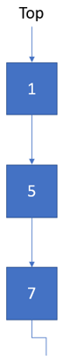
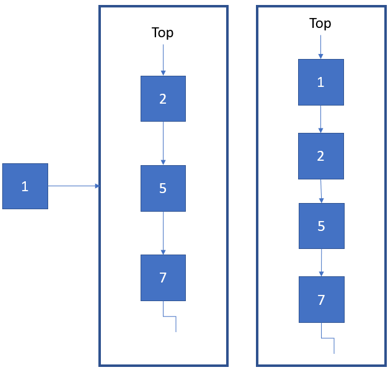
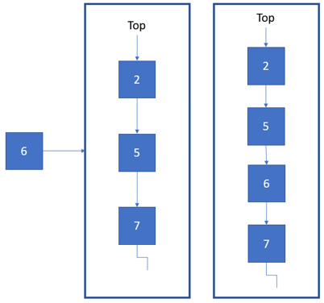

# Priority Queue

## Terminologi

- **Top** - merupakan node yang mempunyai prioritas tertinggi pada priority queue.

## Definisi

Priority Queue adalah salah satu variasi queue yang cukup unik, karena priority queue secara default langsung mengurutkan data yang dimasukkan kedalamnya. Pada priority queue, data akan disusun berdasarkan prioritasnya secara urut, sehingga data yang pertama keluar merupakan data yang mempunyai prioritas tertinggi. Hal ini bisa dimanfaatkan untuk menyelesaikan masalah yang berhubungan dengan hal-hal yang memiliki prioritas berbeda-beda, tidak hanya sekedar push atau pop.

> Istilah "pqueue" akan digunakan untuk memperpendek penulisan "Priority queue".

## Operasi Dasar

- **isEmpty** - untuk memeriksa apakah pqueue kosong atau tidak.
- **push** – untuk menambahkan data baru pada top pqueue.
- **pop** – untuk menghapus data yang berada pada top pqueue.
- **top** – untuk memperoleh data yang berada pada top pqueue.

## Aplikasi Priority Queue

Priotiry Queue digunakan dalam menyelesaikan beberapa permasalahan sebagai berikut.

1. Penjadwalan pada CPU
2. Algoritma graph seperti Dijkstra shortest path dan Prim Minimum Spanning Tree menggunakan struktur data priority queue.
3. Permasalahan pada queue yang melibatkan prioritas didalamnya.


## Implementasi ADT: `PriorityQueue`

[**Link Implementasi Lengkap `PriorityQueue` dapat dilihat di sini**](https://github.com/AlproITS/StrukturData/)

Implementasi yang disajikan disini adalah implementasi **Min-Priority Queue**, yakni memprioritaskan bilangan terkecil.



Implementasi paling sederhana dari pqueue dapat dilakukan dengan menggunakan **Singly Linked List** dengan menggunakan pointer top untuk menunjukkan data paling tinggi prioritasnya pada antrian.

> Catatan: Implementasi Priority Queue menggunakan Linked List bukanlah implementasi yang paling efisien. Jika ingin priority queue yang lebih efisien, dapat diimplementasikan menggunakan struktur data **Heap Tree** (yang pasti akan lebih kompleks).

- ### Representasi Node

    Priority Queue direpresentasikan oleh node bernama **PqueueNode** yang menyimpan data int dan referensi untuk node selanjutnya.

    ```c
    typedef struct pqueueNode_t {
        int data;
        struct pqueueNode_t *next;
    } PQueueNode;
    ```

- ### Struktur PriorityQueue

    Priority Queue memiliki satu pointer referensi pada strukturnya yaitu top, untuk menunjukkan data yang paling tinggi prioritasnya.

    ```c
    typedef struct pqueue_t {
        PQueueNode *_top;
        unsigned _size;
    } PriorityQueue;
    ```

- ### isEmpty

    Untuk memeriksa apakah Priority Queue kosong, cukup dengan memeriksa apakah `top` Priority Queue tersebut bernilai `NULL` atau tidak.

    ```c
    bool pqueue_isEmpty(PriorityQueue *pqueue) {
        return (pqueue->_top == NULL);
    }
    ```

- ### push

    Untuk melakukan push, langkah-langkahnya adalah sebagai berikut.
    + Buat node temp (temporary) yang mengacu pada `top` pqueue.
    + Buat node baru.
    + Jika Priority Queue kosong, jadikan node baru sebagai `top`.
    + Jika tidak kosong, masih terdapat 2 kasus.

    **Kasus 1, data node baru lebih kecil dari top**
    + Buat next node baru ke top pqueue.
    + Pindah top pqueue ke node baru.

    

    **Kasus 2, data node baru lebih besar dari top**
    + Iterasi temp sampai data sebelum node baru tidak ada yang lebih besar.
    + Atau sampai akhir dari pqueue (null).
    + Arahkan next node baru ke next dari temp.
    + Arahkan next dari temp ke node baru.

    

    ```c
    void pqueue_push(PriorityQueue *pqueue, int value)
    {
        PQueueNode *temp = pqueue->_top;
        PQueueNode *newNode = \
            (PQueueNode*) malloc (sizeof(PQueueNode));
        newNode->data = value;
        newNode->next = NULL;

        if (pqueue_isEmpty(pqueue)) {
            pqueue->_top = newNode;
            return;
        }

        if (value < pqueue->_top->data) {
            newNode->next = pqueue->_top;
            pqueue->_top = newNode;
        }
        else {
            while ( temp->next != NULL && 
                    temp->next->data < value)
                temp = temp->next;
            newNode->next = temp->next;
            temp->next = newNode;
        }
    }
    ```

- ### pop

    Untuk melakukan **pop**, langkah-langkahnya adalah sebagai berikut.
    + Memastikan Priority Queue tidak kosong.
    + Membuat node temp (temporary) yang mengacu pada `top` pqueue.
    + Memindah `top` pqueue ke node selanjutnya.
    + Menghapus node temp yang telah dibuat sebelumnya.

    ```c
    void pqueue_pop(PriorityQueue *pqueue)
    {
        if (!pqueue_isEmpty(pqueue)) {
            PQueueNode *temp = pqueue->_top;
            pqueue->_top = pqueue->_top->next;
            free(temp);
        }
    }
    ```
- ### top

    ```c
    int pqueue_top(PriorityQueue *pqueue) {
        if (!pqueue_isEmpty(pqueue))
            return pqueue->_top->data;
        else return 0;
    }
    ```
