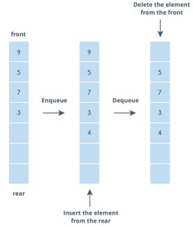

# Queue

## Terminologi

- **front** – merupakan node yang paling depan pada queue.
- **rear** – merupakan node yang paling belakang pada queue.

## Definisi

Queue merupakan struktur data linear yang menggunakan prinsip  **First In First Out** (FIFO). Dengan prinsip FIFO, elemen pertama yang dimasukkan akan menjadi elemen pertama yang akan dikeluarkan. Setiap elemen pada queue selalu ditambahkan di akhir dan dikeluarkan di depan. Contoh penerapannya adalah barisan orang yang menunggu bus. Orang pertama yang pada antrian menjadi yang pertama yang dapat menaiki bus.



Penerapan queue biasa digunakan dalam BFS(Breadth-First-Search) graph transversal.

## Operasi Dasar

- **isEmpty** – untuk memeriksa apakah queue kosong atau tidak.
- **size** – untuk mendapatkan data size pada queue.
- **push/enqueue** – operasi untuk menambahkan data pada antrian dari belakang.
- **pop/dequeue** – operasi untuk menghapus data terdepan pada antrian.
- **front** – untuk mendapatkan data terdepan pada antrian.

**Kompleksitas waktu** semua operasi dilakukan secara konstan O(1).

## Aplikasi Queue

Queue biasa digunakan pada BFS (Breafth First Search) graph transersal yang nantinya akan dijelaskan pada modul selanjutnya. Contoh problem lain yang dapat diselesaikan dengan queue adalah melakukan generate binary number dari 1 hingga n. 

## Implementasi ADT: `Queue` (Linked List Based)

[**Link Implementasi Lengkap `Queue` dapat dilihat di sini**](https://github.com/AlproITS/StrukturData/)

Implementasi queue dapat dilakukan dengan menggunakan **Singly Linked List** dengan menggunakan pointer **`rear`** untuk menunjukkan index paling belakang antrian dan **`front`** untuk menunjukkan index terdepan pada antrian.

- ### Representasi Node

    Queue direpresentasikan oleh node bernama **`QueueNode`** yang menyimpan data `int` dan referensi untuk node selanjutnya.

    ```c
    typedef struct queueNode_t {
        int data;
        struct queueNode_t *next;
    } QueueNode;
    ```

- ### Struktur Queue

    Queue memiliki dua pointer referensi pada strukturnya yaitu **`rear`** dan **`front`**.

    ```c
    typedef struct queue_t {
        QueueNode   *_front, 
                    *_rear;
        unsigned _size;
    } Queue;
    ```

- ### isEmpty

    Untuk memeriksa apakah queue kosong, cukup dengan memeriksa apakah `front` dan `rear` queue tersebut bernilai `NULL` atau tidak.

    ```c
    bool queue_isEmpty(Queue *queue) {
        return (queue->_front == NULL && queue->_rear == NULL);
    }
    ```

- ### push/enqueue

    Untuk melakukan push, langkah-langkahnya adalah sebagai berikut.

    + Buat node baru.
    + Jika queue kosong, jadikan node baru sebagai front dan rear.
    + Jika tidak kosong, maka next dari rear adalah node baru, jadikan node baru sebagai rear.

    ```c
    void queue_push(Queue *queue, int value)
    {
        QueueNode *newNode = (QueueNode*) malloc(sizeof(QueueNode));
        if (newNode) {
            queue->_size++;
            newNode->data = value;
            newNode->next = NULL;
            
            if (queue_isEmpty(queue))                 
                queue->_front = queue->_rear = newNode;
            else {
                queue->_rear->next = newNode;
                queue->_rear = newNode;
            }
        }
    }
    ```

- ### pop/dequeue

    Untuk melakukan pop, dilakukan langkah langkah berikut.

    + Tampung front pada variabel temp (temporary).
    + Mengganti front dengan referensi next dari front.
    + Menghapus node temp.
    + Jika front kosong, maka rear juga kosong.

    ```c
    void queue_pop(Queue *queue)
    {
        if (!queue_isEmpty(queue)) {
            QueueNode *temp = queue->_front;
            queue->_front = queue->_front->next;
            free(temp);
            
            if (queue->_front == NULL)
                queue->_rear = NULL;
            queue->_size--;
        }
    }
    ```

- ### front

    ```c
    int queue_front(Queue *queue)
    {
        if (!queue_isEmpty(queue)) {
            return (queue->_front->data);
        }
        return 0;
    }
    ```
