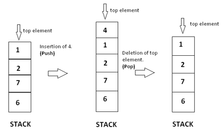

# Stack

## Terminologi

- **Top** - merupakan node paling atas dari stack.

## Definisi

Stack adalah struktur data dinamis yang mengikuti prinsip **Last In First Out (LIFO)**.  Pada LIFO, Elemen terakhir yang dimasukkan pada stack akan menjadi elemen yang pertama dihapus. Sebagai contoh dari Stack adalah tumpukan piring, dimana piring baru diletakkan pada tumpukan paling atas dan dikeluarkan juga dari paling atas.



## Operasi Dasar

- **isEmpty** – untuk memeriksa apakah stack kosong atau tidak.
- **size** – untuk mendapatkan data size pada stack.
- **push** – operasi untuk menambahkan data pada tumpukan paling atas.
- **pop** – operasi untuk menghapus data pada tumpukan paling atas.
- **top/peek** – untuk mendapatkan data pada tumpukan paling atas.

## Aplikasi Stack

Salah satu contoh penerapan Stack adalah bagaimana mengubah notasi infix menjadi postfix. **Notasi infix** adalah notasi yang biasa dibaca dan diselesaikan oleh manusia dalam persoalan matematika, contoh ‘x + y / (10 + z)’ namun komputer tidak dapat membedakan operator dan tanda kurung (parentheses) dengan mudah sehingga komputer akan mengubah notasi infix menjadi **postfix**, contoh ‘x y + 10 z + /’. Untuk  mengubah notasi infix menjadi postfix digunakanlah struktur data stack.

## Implementasi ADT: **`Stack`** (Linked List Based)

[**Link Implementasi Lengkap `Stack` dapat dilihat di sini**](https://github.com/AlproITS/StrukturData/)

Implentasi stack dapat dilakukan dengan menggunakan **Singly Linked List** dengan mengubah **head** pada Singly Linked List menjadi **Top**.

**Kompleksitas waktu** semua operasi pada stack dilakukan secara konstan O(1).

- ### Representasi Node

    Node direpresentasikan oleh struct bernama StackNode yang menyimpan data bertipe `int` dan referensi pada node selanjutnya **`next`**.

    ```c
    typedef struct stackNode_t {
        int data;
        struct stackNode_t *next;
    } StackNode;
    ```

- ### Struktur Stack

    ```c
    typedef struct stack_t {
        StackNode *_top;
        unsigned _size;
    } Stack;
    ```

- ### isEmpty

    Untuk memeriksa apakah stack kosong, cukup dengan memeriksa apakah `top` dari stack tersebut bernilai `NULL` atau tidak.

    ```c
    bool stack_isEmpty(Stack *stack) {
        return (stack->_top == NULL);
    }
    ```

- ### push

    + Buat node baru.
    + Jika stack kosong, jadikan node baru sebagai `top`.
    + Jika tidak kosong, maka jelas bahwa next dari node baru adalah `top`, jadikan node baru sebagai `top`.

    ```c
    void stack_push(Stack *stack, int value) 
    {
        StackNode *newNode = (StackNode*) malloc(sizeof(StackNode));
        if (newNode) {
            stack->_size++;
            newNode->data = value;
            
            if (stack_isEmpty(stack)) newNode->next = NULL;
            else newNode->next = stack->_top;

            stack->_top = newNode;
        }
    }
    ```

- ### pop

    Untuk melakukan pop, dilakukan langkah langkah berikut.

    + Tampung `top` pada variabel temp (temporary).
    + Mengganti `top` dengan referensi next dari `top`.
    + Menghapus node temp.

    ```c
    void stack_pop(Stack *stack) 
    {
        if (!stack_isEmpty(stack)) {
            StackNode *temp = stack->_top;
            stack->_top = stack->_top->next;
            free(temp);
            stack->_size--;
        }
    }
    ```

- ### top

    ```c
    int stack_top(Stack *stack) 
    {
        if (!stack_isEmpty(stack)) 
            return stack->_top->data;
        return 0;
    }
    ```