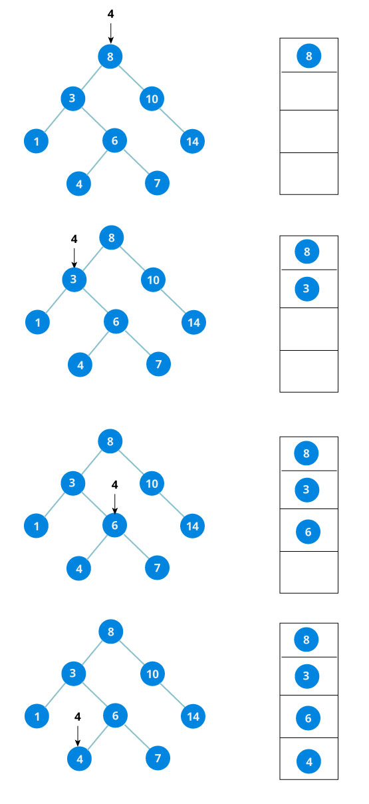
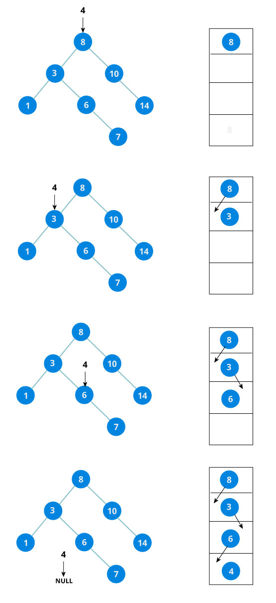
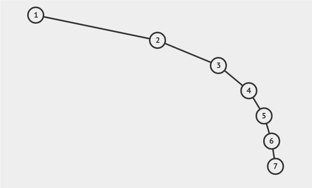
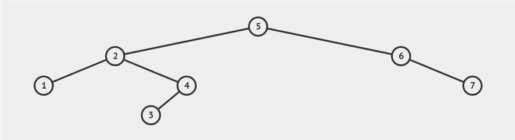

# Binary Search Tree

**Binary Search Tree (BST)** adalah struktur data Binary Tree berbasis node yang memiliki properti berikut:

- Subtree kiri dari sebuah node hanya berisi node dengan key **lebih kecil** dari key node.
- Subtree kanan sebuah node hanya berisi node dengan key **lebih besar** dari key node.
- Subtree kiri dan kanan masing-masing juga harus berupa BST.


> Sumber Gambar: https://cdn.programiz.com/sites/tutorial2program/files/bst-vs-not-bst.jpg

## Implementasi Binary Search Tree

[**Link Implementasi Lengkap `Binary Search Tree` dapat dilihat di sini**](https://github.com/AlproITS/StrukturData/)

### Representasi Node

**Sebuah node** dalam Binary Search Tree paling dasar mempunyai properti:

- Data atau _key_ yang disimpan,
- Referensi ke node kiri (left), dan
- Referensi ke node kanan (right).

```c
typedef struct bstnode_t {
    int key;
    struct bstnode_t \
        *left, *right;
} BSTNode;
```

### Struktur BST

```c
typedef struct bst_t {
    BSTNode *_root;
    unsigned int _size;
} BST;
```

- ### Find

    Untuk melakukan pencarian sebuah key pada Binary Search Tree, dapat kita lakukan secara rekursif maupun iteratif. Implementasi kali ini akan menggunakan cara iteratif.

    **Utility Function**
    ```c
    BSTNode* __search(BSTNode *root, int value) {
        while (root != NULL) {
            if (value < root->key)
                root = root->left;
            else if (value > root->key)
                root = root->right;
            else
                return root;
        }
        return root;
    }
    ```

    **Primary Function**
    ```c
    bool bst_find(BST *bst, int value) {
        BSTNode *temp = __search(bst->_root, value);
        if (temp == NULL)
            return false;
        
        if (temp->key == value)
            return true;
        else
            return false;
    }
    ```
    **Contoh**

    
    > Sumber Gambar: https://cdn.programiz.com/sites/tutorial2program/files/bst-search-downward-recursion-step.jpg

- ### Insert

    Key baru selalu dimasukkan pada leaf. Kita mulai mencari key dari root hingga kita menyentuh node leaf. Setelah node leaf ditemukan, node baru ditambahkan sebagai anak dari node leaf.

    **Utility Function**
    ```c
    BSTNode* __insert(BSTNode *root, int value) {
        if (root == NULL) 
            return __createNode(value);

        if (value < root->key)
            root->left = __insert(root->left, value);
        else if (value > root->key)
            root->right = __insert(root->right, value);
        
        return root;
    }
    ```

    **Primary Function**
    ```c
    void bst_insert(BST *bst, int value) {
        if (!bst_find(bst, value)) {
            bst->_root = __bst__insert(bst->_root, value);
            bst->_size++;
        }
    }
    ```
    **Contoh**

    
    > Sumber Gambar: https://cdn.programiz.com/sites/tutorial2program/files/bst-downward-recursion-step.jpg

- ### Remove

    **Utility Function**

    FindMinNode :

    ```c
    BSTNode* __findMinNode(BSTNode *node) {
        BSTNode *currNode = node;
        while (currNode && currNode->left != NULL)
            currNode = currNode->left;
        
        return currNode;
    }
    ```

    Remove :

    ```c
    BSTNode* __remove(BSTNode *root, int value) {
        if (root == NULL) return NULL;

        if (value > root->key) 
            root->right = __remove(root->right, value);
        else if (value < root->key) 
            root->left = __remove(root->left, value);
        else {
            
            if (root->left == NULL) {
                BSTNode *rightChild = root->right;
                free(root);
                return rightChild;
            }
            else if (root->right == NULL) {
                BSTNode *leftChild = root->left;
                free(root);
                return leftChild;
            }

            BSTNode *temp = __findMinNode(root->right);
            root->key     = temp->key;
            root->right   = __remove(root->right, temp->key);
        }
        return root;
    }
    ```

    **Primary Function**

    ```c
    void bst_remove(BST *bst, int value) {
        if (bst_find(bst, value)) {
            bst->_root = __bst__remove(bst->_root, value);
            bst->_size--;
        }
    }
    ```

## Skewed Tree

Apabila urutan insertion tree kalian 1 2 3 4 5 6 7, maka bentuk tree akan seperti gambar di bawah, dan ini dinamakan **Skewed Tree**.



> Binary Search Tree akan menjadi _skewed_ apabila urutan insertionnya berupa sekuens yang telah urut (baik ascending maupun descending). Skewed BST merupakan bentuk BST yang paling tidak seimbang.

Urutan insertion pada BST, akan mempengaruhi bentuk tree. Misalkan, jika urutan insertionnya 5 2 1 4 3 6 7, maka bentuk tree akan seperti berikut.




