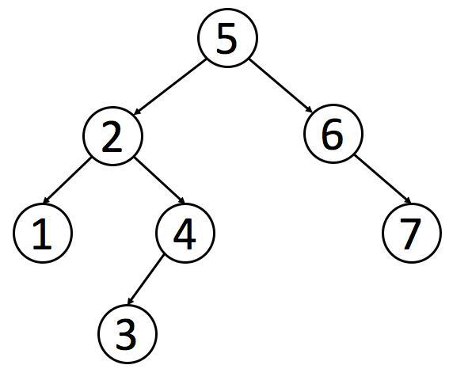

## Traversal Binary Search Tree

- ### Inorder Traversal

    ```c
    void __inorder(BSTNode *root) {
        if (root) {
            __inorder(root->left);
            printf("%d ", root->key);
            __inorder(root->right);
        }
    }
    ```

- ### Postorder Traversal

    ```c
    void __postorder(BSTNode *root) {
        if (root) {
            __postorder(root->left);
            __postorder(root->right);
            printf("%d ", root->key);
        }
    }
    ```

- ### Preorder Traversal

    ```c
    void __preorder(BSTNode *root) {
        if (root) {
            printf("%d ", root->key);
            __preorder(root->left);
            __preorder(root->right);
        }
    }
    ```

Misal pada Binary Search Tree berikut :



Hasil printout maka seperti berikut :

- Inorder : 1 2 3 4 5 6 7
- Postorder : 1 3 4 2 7 6 5
- Preorder : 5 2 1 4 3 6 7
