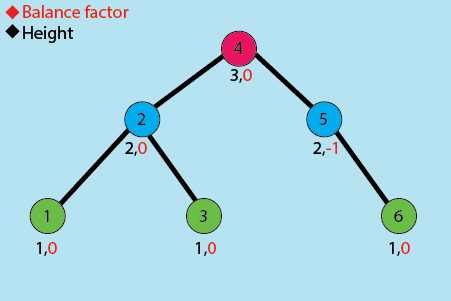
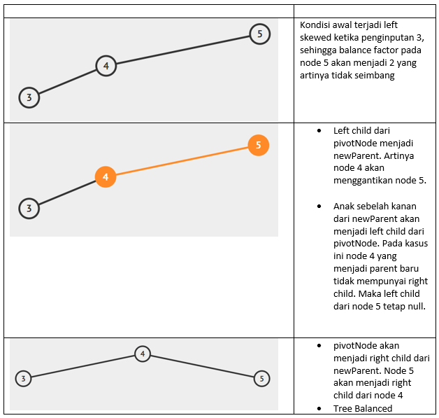
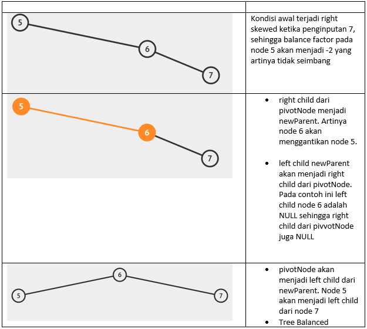
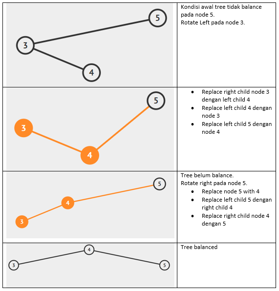
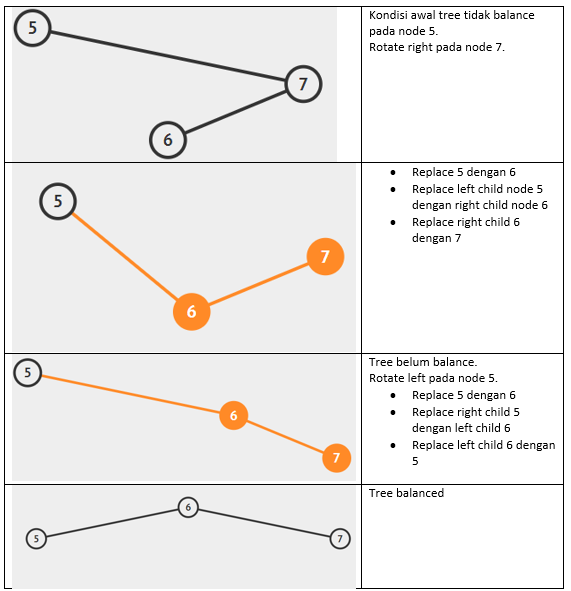

<p></p>

# AVL Tree (*Adelson-Velsky and Landis Tree*)

AVL tree merupakan sebuah self balanced BST dimana setiap nodenya mempertahankan perbedaan tinggi antara node kiri dan node kananya yang disebut balance factor. Nilai balance factor pada AVL tidak boleh melebihi 1. 

## Terminologi AVL Tree

AVL memiliki terminology yang sama seperti pada modul sebelumnya, hanya terdapat beberapa tambahan terminology yang belum dibahas sebelumnya.

- Height : banyaknya tingkatan/level dalam suatu tree.
- Balance Factor :  selisih antara height node kiri dengan node kanan
- Ancestor : seluruh node yang terletak diatas node dan memiliki jalur yang sama



## Representasi Node

[**Link Implementasi Lengkap `AVL Tree` dapat dilihat di sini >**](https://github.com/AlproITS/StrukturData/)

Representasi node pada AVL Tree sama dengan BST hanya saja ada tambahan data berupa tinggi pada tiap nodenya.

```c
typedef struct AVLNode_t
{
    int data;
    struct AVLNode_t *left,*right;
    int height;
}AVLNode;

typedef struct AVL_t
{
    AVLNode *_root;
    unsigned int _size;
}AVL;
```

- Untuk menginisiasi sebuah AVl kita bisa menggunakan fungsi `avl_init()`.

    ```c
    void avl_init(AVL *avl) {
        avl->_root = NULL;
        avl->_size = 0u;
    }
    ```

- Variable height digunakan untuk mendapatkan balance factor dari suatu node.

    ```c
    int _getHeight(AVLNode* node){
        if(node==NULL)
            return 0; 
        return node->height;
    }
    ```

## Rotasi

AVL sendiri akan menyeimbangkan dirinya dengan merotasi tree tersebut hingga tree tersebut menjadi balanced. 

Terdapat 2 macam rotasi utama yang dipakai dalam avl yaitu Rotasi Right dan Rotasi Left. Untuk menentukan rotasi apa yang harus dilakukan maka pertama kita harus tahu balance factor dari tree tersebut dengan membandingkan selisih antara height subtree kiri dan height subtree kanan.

```c
int _getBalanceFactor(AVLNode* node){
    if(node==NULL)
        return 0;
    return _getHeight(node->left)-_getHeight(node->right);
}
```

Dari balance factor tersebut kita memiliki 4 kemunkinan kejadian: 

1. Apabila Balance Factor > 1 / tinggi subtree kiri > tinggi subtree kanan :
    - Apabila tinggi subtree kiri > subtree kanan (**Case left skewed**) -> **Rotasi Right** 
    - Apabila tinggi subtree kiri < subtree kanan (**Case left right zigzag**) -> **Rotasi Left Diikuti Rotasi Right**

2. Apabila Balance Factor < -1 / tinggi subtree kanan > tinggi subtree kiri : 
    - Apabila tinggi subtree kanan > subtree kiri (**Case right skewed**) -> **Rotasi Left**
    - Apabila tinggi subtree kanan < subtree kiri (**Case right left zigzag**) -> **Rotasi Right Diikuti Rotasi Left**

Terdapat dua macam rotasi yang digunakan, yaitu rotasi kiri dan kanan.

- ### Rotasi Kanan (Case Left-Skewed)

    ```c
    AVLNode* _rightRotate(AVLNode* pivotNode){

        AVLNode* newParrent=pivotNode->left;
        pivotNode->left=newParrent->right;
        newParrent->right=pivotNode;

        pivotNode->height=_max(_getHeight(pivotNode->left),
                        _getHeight(pivotNode->right))+1;
        newParrent->height=_max(_getHeight(newParrent->left),
                        _getHeight(newParrent->right))+1;
        
        return newParrent;
    }
    ```

    > **`pivotNode`** merupakan current Node kita yang akan kita jadikan patokan rotasi.

    Untuk rotasi kanan caranya adalah child sebelah kiri dari pivotNode menjadi parent baru. Kemudian anak sebelah kanan dari parent baru akan menjadi left child dari pivotNode. Kemudian pivotNode akan menjadi right child dari parent baru. Kemudian lakukan update height untuk pivotNode dan newParrent node.

    **Right rotation** ini bisa menyelesaikan permasalahan untuk **Case Left Skewed**.

    ```c
    AVLNode* _leftCaseRotate(AVLNode* node){
        return _rightRotate(node);
    }
    ```

    

- ### Rotasi Kiri (Case Right-Skewed)

    ```c
    AVLNode* _leftRotate(AVLNode* pivotNode){

        AVLNode* newParrent=pivotNode->right;
        pivotNode->right=newParrent->left;
        newParrent->left=pivotNode;

        pivotNode->height=_max(_getHeight(pivotNode->left),
                        _getHeight(pivotNode->right))+1;
        newParrent->height=_max(_getHeight(newParrent->left),
                        _getHeight(newParrent->right))+1;
        
        return newParrent;
    }
    ```

    Pada rotasi kiri caranya adalah right child dari pivotNode akan menjadi menjadi parent baru. Kemudian left child dari newParent akan menjadi right child pivotNode. Kemudian pivotNode akan menjadi right child dari parent baru. Kemudian lakukan update height untuk pivotNode dan newParrent node.

    **Left Rotation** ini bisa menyelesaikan permasalahan untuk **Case Right Skewed**.

    ```c
    AVLNode* _rightCaseRotate(AVLNode* node){
        return _leftRotate(node);
    }
    ```

    


- ### Case Left-Right Zig-zag

    Case left right zigzag bisa diselesaikan menggunakan left rotation diikuti right rotation.

    ```c
    AVLNode* _leftRightCaseRotate(AVLNode* node){
        node->left=_leftRotate(node->left);
        return _rightRotate(node);
    }
    ```

    

- ### Case Right-Left Zig-zag

    ```c
    AVLNode* _rightLeftCaseRotate(AVLNode* node){
        node->right=_rightRotate(node->right);
        return _leftRotate(node);
    }
    ```

    

## Search dan Insertion

Dalam melakukan insert pada sebuah AVL kita perlu terlebih dahulu melakukan insert newnode standar seperti BST. Kemudian update nilai height setiap ancestor newnode. Untuk nilai height pada leaf adalah 1( nilai ini dipilih agar lebih mudah dalam menghandle empty node). Untuk setiap node selain leaf heightnya adalah nilai tertinggi diantara kedua childnya ditambah 1. Kemudian lakukan pengecekan terhadap balance factor setiap ancestor nodenya. Balance factor bisa didapat dari tinggi node kiri dikurangi tinggi node kanan. Jika ditemukan ada node yang tidak balance maka akan dilakukan rotasi.

- ### Fungsi Utilitas

    Untuk membuat sebuah node baru.

    ```c
    AVLNode* _avl_createNode(int value) {
        AVLNode *newNode = (AVLNode*) malloc(sizeof(AVLNode));
        newNode->data = value;
        newNode->height=1;
        newNode->left = newNode->right = NULL;
        return newNode;
    }
    ```

    Untuk melakukan pencarian node dengan nilai tertentu.

    ```c
    AVLNode* _search(AVLNode *root, int value) {
        while (root != NULL) {
            if (value < root->data)
                root = root->left;
            else if (value > root->data)
                root = root->right;
            else
                return root;
        }
        return root;
    }
    ```

    Fungis utilitas untuk melakukan insert data dalam sebuah AVL.

    ```c
    AVLNode* _insert_AVL(AVL *avl,AVLNode* node,int value){
        
        if(node==NULL)
            return _avl_createNode(value);
        if(value < node->data)
            node->left = _insert_AVL(avl,node->left,value);
        else if(value > node->data)
            node->right = _insert_AVL(avl,node->right,value);
        
        node->height= 1 + _max(_getHeight(node->left),_getHeight(node->right)); 

        int balanceFactor=_getBalanceFactor(node);
        
        if(balanceFactor > 1 && value < node->left->data)
            return _leftCaseRotate(node);
        if(balanceFactor > 1 && value > node->left->data)
            return _leftRightCaseRotate(node);
        if(balanceFactor < -1 && value > node->right->data)
            return _rightCaseRotate(node);
        if(balanceFactor < -1 && value < node->right->data)
            return _rightLeftCaseRotate(node);
        
        return node;
    }
    ```

- ### Fungsi Utama

    Fungsi utama untuk mencari sebuah nilai.

    ```c
    bool avl_find(AVL *avl, int value) {
        AVLNode *temp = _search(avl->_root, value);
        if (temp == NULL)
            return false;
        
        if (temp->data == value)
            return true;
        else
            return false;
    }
    ```

    Fungsi utama untuk memasukan sebuah data.

    ```c
    void avl_insert(AVL *avl,int value){
        if(!avl_find(avl,value)){
            avl->_root = _insert_AVL(avl,avl->_root,value);
            avl->_size++;
        }
    }
    ```

## Deletion

Tidak jauh berbeda dengan melakukan insert pada AVL dalam melakukan remove pada sebuah AVL kita perlu terlebih dahulu melakukan remove standar seperti BST. Kemudian update nilai height setiap ancestor node. Kemudian lakukan pengecekan terhadap balance factor setiap ancestor nodenya. Jika ditemukan ada node yang tidak balance maka akan dilakukan rotasi.

- ### Fungsi Utilitas

    ```c
    AVLNode* _findMinNode(AVLNode *node) {
        AVLNode *currNode = node;
        while (currNode && currNode->left != NULL)
            currNode = currNode->left;
        return currNode;
    }
    ```

    ```c
    AVLNode* _remove_AVL(AVLNode* node,int value){
        if(node==NULL)
            return node;
        if(value > node->data)
            node->right=_remove_AVL(node->right,value);
        else if(value < node->data)
            node->left=_remove_AVL(node->left,value);
        else{
            AVLNode *temp;
            if((node->left==NULL)||(node->right==NULL)){
                temp=NULL;
                if(node->left==NULL) temp=node->right;  
                else if(node->right==NULL) temp=node->left;
                
                if(temp==NULL){
                    temp=node;
                    node=NULL;
                }
                else
                    *node=*temp;   
                
                free(temp);
            }
            else{
                temp = _findMinNode(node->right);
                node->data=temp->data;
                node->right=_remove_AVL(node->right,temp->data);
            }    
        }

        if(node==NULL) return node;
        
        node->height=_max(_getHeight(node->left),_getHeight(node->right))+1;

        int balanceFactor= _getBalanceFactor(node);
        
        if(balanceFactor>1 && _getBalanceFactor(node->left)>=0) 
            return _leftCaseRotate(node);

        if(balanceFactor>1 && _getBalanceFactor(node->left)<0) 
            return _leftRightCaseRotate(node);
    
        if(balanceFactor<-1 && _getBalanceFactor(node->right)<=0) 
            return _rightCaseRotate(node);

        if(balanceFactor<-1 && _getBalanceFactor(node->right)>0) 
            return _rightLeftCaseRotate(node);
        
        return node;
    }
    ```

- ### Fungsi Utama

    ```c
    void avl_remove(AVL *avl,int value) {
        if(avl_find(avl,value)) {
            avl->_root=_remove_AVL(avl->_root,value);
            avl->_size--;
        }
    }
    ```
