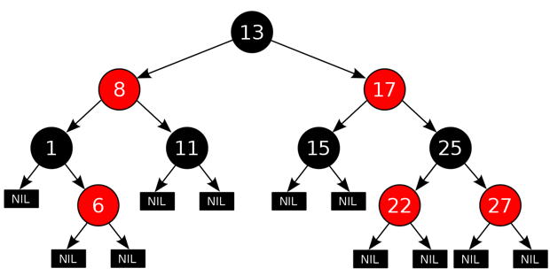

## Apa itu Self-Balancing BST?

Self-Balancing BST merupakan sebuah binary tree yang dapat menyeimbangkan dirinya sendiri, dalam hal ini meminimalisir perbedaan tinggi (height) saat terjadi insertion atau deletion pada node-node pohon tersebut. Self-Balancing BST ini berguna untuk mempercepat pencarian dalam sebuah binary tree. Dengan menggunakan Self Balancing BST memungkinkan kita mendapatkan kompleksitas waktu O(log n).

## Variasi BST

Terdapat beberapa tree yang menerapkan konsep Self Blanced BST. Beberapa diantaranya adalah 

Red-Black Tree, AVL Tree, B-Tree dan lainya. Setiap Self-Balanced BST mempunyai kondisi tertentu dalam melakukan balancing. Pada Red-Black Tree menggunakan pewarnaan node sebaagi metode balancing.

> Gambar **Red-Black Tree**. Sumber: https://upload.wikimedia.org/wikipedia/commons/thumb/6/66/Red-black_tree_example.svg/1200px-Red-black_tree_example.svg.png

Sementara pada AVL Tree untuk melakukan balancing digunakan perbedaan height antara node kiri dan kanan. Untuk menjaga keseimbangan tingginya maka AVL melakukan rotasi node ketika melakukan insertion dan deletion. Pada Modul ini akan dibahas lebih lanjut mengenai AVL Tree.