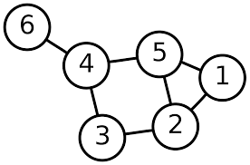

# Traversal Graf

## Depth First Search (DFS)

Sesuai dengan namanya, DFS akan melakukan traversal sampai ke _vertex_ yang paling 'dalam'. Setiap kali sampai di suatu _vertex_ $u$, DFS akan memilih salah satu _vertex_ yang terhubung dengan vertex $u$ dan belum pernah dikunjungi sebelumnya, lalu melanjutkan penelusuran dari _vertex_ tersebut. Langkah ini terus dilakukan selama kita masih menemukan _vertex_ yang masih bisa dikunjungi. Jika sudah tidak ada, akan dilakukan _backtracking_ lalu kembali mencari _vertex_ yang bisa dikunjungi.  
Contoh pengimplementasian dalam _weighted_ graf dapat dilakukan secara rekursif seperti kode berikut:  

```cpp
vector<pair<int,int>> adjList[N];
bool visited[N];

void dfs(int curVertex)
{
    //menandai bahwa vertex ini sudah pernah dikunjungi
    visited[curVertex] = 1; //Perhatikan baris ini untuk trivia question
    for (int i = 0 ; i < adjList[curVertex].size() ; i++) //menelusuri daftar vertex yang terhubung dengan curVertex
    {
        int nextVertex = adjList[curVertex][i].first;
        //perhatikan bahwa dalam pair,
        // first merupakan nomor vertex serta second
        //merupakan weightnya
        if (!visited[nextVertex]) //mengecek jika belum dikunjungi
        {
            dfs(adjList[curVert]);
            //do something
        }
    }
    //do something
}
```

## Breadth First Search (BFS)

Traversal menggunakan BFS dimulai dari sebuah vertex, lalu akan mengunjungi _vertex_ yang terhubung langsung dengan _vertex_ tersebut (layer 1). Lalu, di langkah selanjutnya akan mengunjungi _vertex_ yang terhubung langsung dengan _vertex_ - _vertex_ pada layer 1 (layer 2) dan seterusnya sampai sudah tidak ada lagi _vertex_ yang bisa dikunjungi.  
Berbeda dengan DFS, pengimplementasian BFS dapat dilakukan secara iteratif dengan menggunakan bantuan `queue` seperti berikut :  

```cpp
vector<int> adjList[N];
bool visited[N];

void bfs(int startNode)
{
    queue<int> q;
    q.push(startNode);
    visited[startNode] = 1;
    while (!q.empty()) // ada yang tau kenapa seperti ini?
    {
        int curNode = q.front();
        q.pop();
        for (int i = 0 ; i < adj[curNode].size() ; i++) // sama seperti DFS
        {
            int nextNode = adj[curNode][i];
            if (!visited[nextNode])
            {
                q.push(nextNode);
                vis[nextNode] = 1; //Perhatikan baris ini untuk trivia question
            }
        }
    }
}
```

Trivia question : pada DFS, kita melakukan penandaan pada node sebelum mengiterasi isi dari adjacency list, sedangkan pada BFS, kita melakukan penandaan di dalam iterasi. Apakah timing penempatan tanda ini berpengaruh pada algoritma-algoritma tersebut? Jika iya, apa pengaruhnya?  



Jika kita melakukan BFS pada graf tersebut dari vertex 1, maka vertex-vertex tiap layer adalah:  

- Layer 0 : 1
- Layer 1 : 2 5
- Layer 2 : 3 4
- Layer 3 : 6

Perhatikan bahwa jumlah layer adalah jumlah dari edge minimal yang harus dilewati untuk sampai ke vertex tersebut dari vertex 1 atau biasa disebut dengan _shortest path_.
