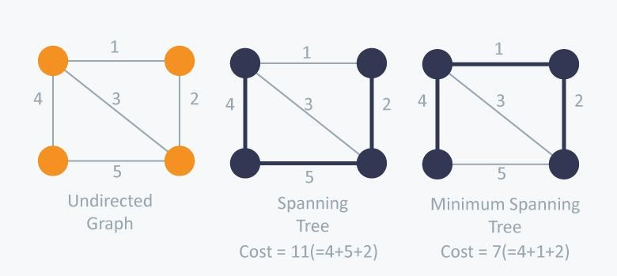
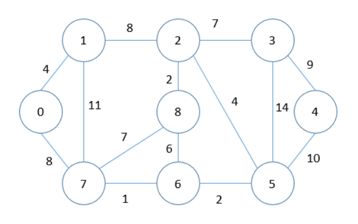
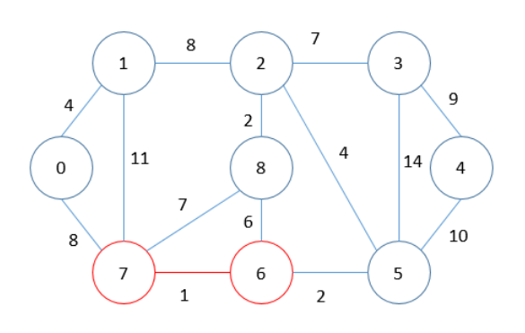
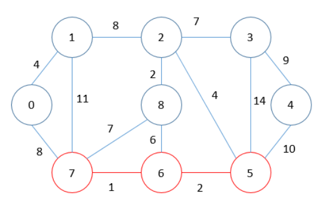
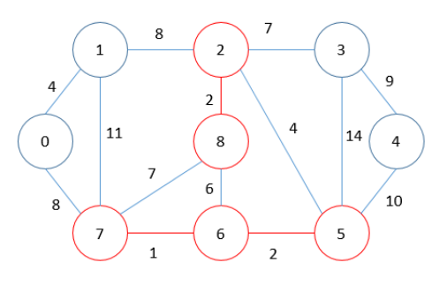
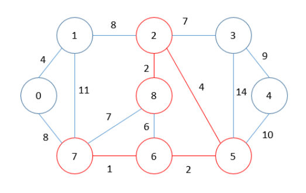
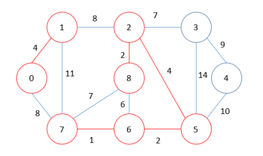
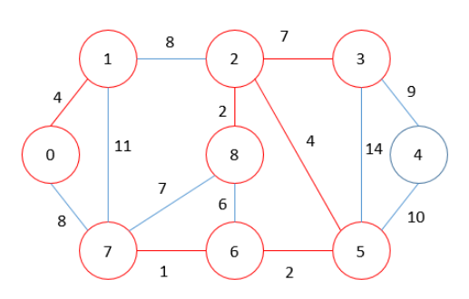
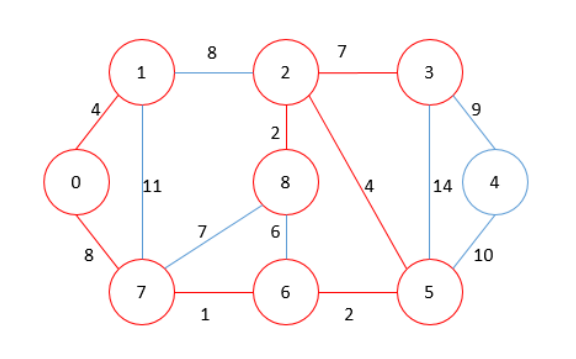
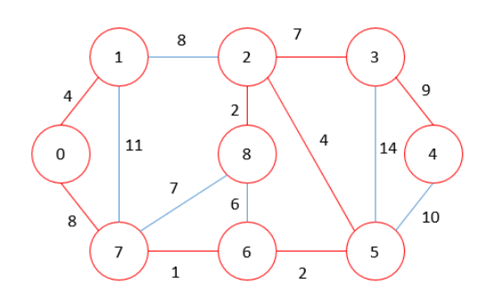

# Minimum Spanning Tree

## Spanning Tree

Misalkan terdapat sebuah graph G yang merupakan undirected weighted graph, maka Spanning Tree merupakan sebuah subgraph dari G dimana semua vertex dapat dikunjungi dan tidak terdapat cycle pada graph tersebut.

## Minimum Spanning Tree

**Minimum Spanning Tree merupakan Spanning Tree yang memiliki cost paling minimum di antara semua Spanning Tree.** Cost yang dimaksud adalah jumlah weight dari semua edge yang ada pada tree tersebut. Memungkinkan untuk terdapat lebih dari 1 Minimum Spanning Tree.



Terdapat 2 implementasi yang terkenal untuk mengimplementasikan Minimum Spanning Tree, yaitu *Kruskal’s Algorithm* dan *Prim’s Algorithm*. Namun yang akan kita bahas saat ini adalah *Kruskal’s Algorithm*.

## Algoritma Kruskal

**Algoritma Kruskal menambahkan edge satu per satu sehingga menjadi Spanning Tree.** Algoritma Kruskal merupakan pendekatan greedy di mana pada setiap iterasi mencari edge dengan weight terkecil untuk ditambahkan sehingga dapat membentuk Spanning Tree.

Pada Algoritma Kruskal, untuk mendapatkan Minimum Spanning Tree, berikut merupakan 3 langkah yang dilakukan:
1.  Sort secara non-descending (tidak menurun) semua edge berdasarkan weight-nya
2.  Tambahkan edge dengan weight terkecil. Apabila terjadi cycle pada Spanning Tree, maka hapus edge tersebut. Apabila tidak, tambahkan edge tersebut pada Spanning Tree.
3.  Lakukan langkah ke-2 hingga terbentuk V – 1 edge pada Spanning Tree.

- ## Contoh:


MST = 0

MST = 1

MST = 3

MST = 5

MST = 9

MST = 13

MST = 20

MST = 28

MST = 37

***

**Untuk menentukan apakah penambahan suatu edge dapat menyebabkan cycle, dapat dilakukan disjoint set union (DSU).** DSU akan memiliki operasi untuk menggabungkan dua set, dan itu akan dapat menentukan set elemen tertentu. Dengan cara mencari parent dari 2 set yang akan dilakukan pengecekan. Apabila 2 set tersebut memiliki parent yang sama, maka jika dilakukan penambahan edge akan terjadi cycle. Karena itu, edge tidak ditambahkan pada Spanning Tree.

- ### Find
    Untuk melakukan pencarian parent suatu vertex, kita dapat melakukannya secara iteratif maupun rekursif. Implementasi kali ini menggunakan rekursif.

    ```C
    int find(int x) {
        if(par[x] != x) {
            return par[x] = find(par[x]);
        }
    return x;
    }    
    ```

- ### Kruskal

    ```C
    void Kruskal() {
        int res = 0;
        for(int i = 0; i < edge.size(); i++) {
            int src = edge[i].src;
            int dst = edge[i].dst;
            int w = edge[i].w;
            int parSrc = find(src);
            int parDst = find(dst);

            // Disjoint Set
            if(parSrc != parDst) {
                res += w;
                par[parSrc] = par[parDst];
            }
        }
        cout << res << endl;
        return;
    }
    ```