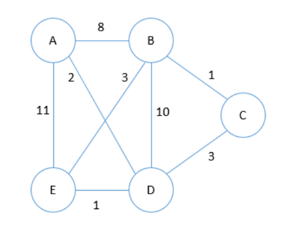
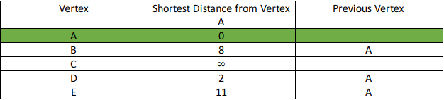
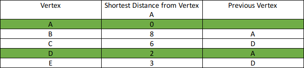
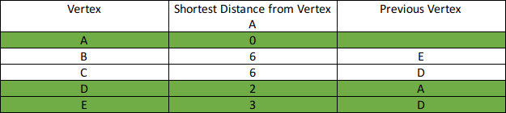
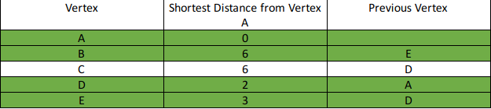
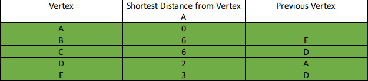

# Shortest Path

## Shortest Path Problem

**Pada permasalahan graph, Shortest Path Problem merupakan pencarian path dari 2 vertex pada suatu graph yang mempunyai penjumlahan weight yang paling minimum.** Permasalahan ini dapat diselesaikan dengan mudah menggunakan BFS apabila semua edge mempunyai weight 1. Namun, pada permasalahan kali ini, weight dapat bernilai berapapun. Terdapat banyak sekali implementasi untuk penyelesaian Shortest Path Problem, tapi yang akan kita bahas saat ini adalah *Dijkstra’s Algorithm*.

## Algoritma Djikstra

Algoritma Dijkstra sendiri mempunyai banyak variasi, tapi yang paling umum adalah untuk mencari shortest path dari source vertex ke semua vertex lainnya.

- ### Langkah-langkah:
1.  Set semua jarak vertex dengan infinity (dapat digantikan dengan nilai yang sangat besar atau nilai yang tidak akan terpakai) kecuali jarak dari source yang akan di-set 0.
2.  Push vertex source ke min-priority queue (priority queue dengan pengurutan dari kecil ke besar) dengan format (distance, vertex), untuk pembanding dari min-priority queue akan menggunakan distance dari vertex.
3.  Pop vertex dengan distance yang paling minimum dari priority queue
4.  Update distance dari vertex yang terhubung ke vertex yang telah di-pop (vertex dari hasil langkah ke-3) dengan case “distance vertex yang sekarang + edge weight < next vertex distance”, lalu push vertex tersebut.
5.  Apabila hasil dari pop vertex tersebut telah di visit sebelumnya, maka lakukan continue.
6.  Lakukan langkah ke-3 sampai ke-5 hingga priority queue kosong.

- ### Contoh:
Cari shortest path dari vertex A ke semua vertex lainnya.



***

Inisial:\


Step 1:\


Step 2:\


Step 3:\


Step 4:\


Step 5:\


- ### Implementasi Djikstra:

    ```C
    // pii pair of integer, integer
    typedef pair <int, int> pii;
    int dist[10];
    vector <pii> v[10];

    void dijkstra(int s, int n) {
        priority_queue <pii, vector <pii>, greater <pii> > pq;
        set <int> seen;
        memset(dist, -1, sizeof(dist));
        dist[s] = 0;
        pq.push({0, s});
        while(!pq.empty()) {
            pii now = pq.top();
            pq.pop();
            if(seen.find(now.second) != seen.end()) continue;
            seen.insert(now.second);
            for(int i = 0; i < v[now.second].size(); i++) {
                int next = v[now.second][i].second;
                int cost = v[now.second][i].first;

                if(now.first + cost < dist[next] || dist[next] == -1) {
                    dist[next] = now.first + cost;
                    pq.push({dist[next], next});
                }
            }
        }
        for(int i = 0; i < n; i++) {
            cout << "from " << s << " to " << i << " : " << dist[i] << endl;
        }
        return;
    }
    ```