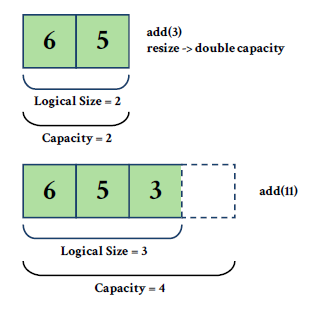
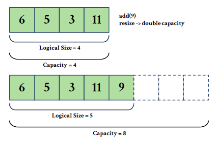

# Dynamic Array

Array is a fundamental data structure that is often used for storing data. It is static, which means its size is constant and cannot grow or shrink. It is possible to access an array element in a constant time as well (notated as # O(1)).

> We're going to use the term **“Static Array”** to address fixed-size arrays

## Definition

Like the name says, a **dynamic array** has the ability to change size according to how many data are inserted while still maintaining the indexing characteristic of a normal array.

## Illustration

A dynamic array is usually implemented using a static array with an initial capacity.

Suppose an integer array with an initial capacity of 2. When the array is already filled with two elements (6 and 5), when a third element is to be added, the array is already at maximum capacity.



When a dynamic array is full, the program automatically allocates space for a new array usually double the initial size (growth factor = 2). It then copies the elements from the original array to the new resized one. Here, we can see two areas of the new array:

- **_Logical Size_** is the accessible area (accessible through indexing).
- **_Capacity_** is the actual array size, with area outside the logical size being inaccessible.




## Static Array vs Dynamic Array

Below is a comparison table between Static Array and Dynamic Array.

**Static Array**|**Dynamic Array**
-----|-----
Fixed size.|Size can change according to amount of input data.
Efficient, no memory reallocation needed.|Needs memory allocation-reallocation in run-time.
Great to use if size of data is known from the beginning.|Suitable if size of data is not fixed.
There is possibility of memory waste.|Small chance of memory waste if implemented right.

## Basic Operations

In general, a dynamic array supports basic operations such as:

- **pushBack** – inserting new element from the end of the array, as previously illustrated.
- **popBack** – deleting the last element.
- **back** – accessing the last element.
- **front** – accessing the front element.
- **getAt(i)** – accessing the i-th element (O(1) complexity).
- **setAt(i, value)** – changing existing value of i-th element with a new one.
- **isEmpty** – checking whether the array is empty or not.

## ADT Implementation: **`DynamicArray`**

[**The full implementation of `Dynamic Array` in C and C++ can be found here**](https://github.com/AlproITS/StrukturData/)

The implementation of a dynamic array in this module will be represented as an array of integers. The initial capacity is 2 with growth factor being 2 as well.

Below is the time complexity of the Dynamic Array implementation in this module.

**Operation**|**Time Complexity**
-----|-----
isEmpty|O(1)
pushBack|**amortized** O(1)
popBack|O(1)
back|O(1)
front|O(1)
setAt|O(1)
getAt|O(1)

- ### Dynamic Array Structure

    The structure of a dynamic array as an ADT can be defined as below: with array as `_arr`, size as `_size` and capacity as `_capacity`.

    ```c
    typedef struct dynamicarr_t {
        int *_arr;
        unsigned _size, _capacity;
    } DynamicArray;
    ```

- ### isEmpty

    To check whether an array is empty or not, we can check the value of `_size` like the function below.

    ```c
    bool dArray_isEmpty(DynamicArray *darray) {
        return (darray->_size == 0);
    }
    ```

- ### pushBack

    There are two use cases of **pushBack**:

    **Use Case 1: when array capacity is still sufficient**

    + `pushBack` inserts data at the end, after the latest inserted element.

    **Use Case 2: when array is at maximum capacity**

    + A new array is made with twice the size of the original one.
    + Elements from original array are copied to the new array.
    + Reference the new array as the existing array.
    + Delete (free) old array.
    + Insert new element after the last element of the new array.

    ```c
    void dArray_pushBack(DynamicArray *darray, int value)
    {
        if (darray->_size + 1 > darray->_capacity) {
            unsigned it;
            darray->_capacity *= 2;
            int *newArr = (int*) malloc(sizeof(int) * darray->_capacity);

            for (it=0; it < darray->_size; ++it)
                newArr[it] = darray->_arr[it];
            
            int *oldArray = darray->_arr;
            darray->_arr = newArr;
            free(oldArray);
        }
        darray->_arr[darray->_size++] = value;
    }
    ```

- ### popBack

    Removing the last element by using **popBack** can be done by decreasing the size of the array, so that accessible indexes do not exceed the size's value. Make sure the array is not empty before executing **popBack**.

    ```c
    void dArray_popBack(DynamicArray *darray) {
        if (!dArray_isEmpty(darray)) darray->_size--;
        else return;
    }
    ```

- ### back

    To access the last element of an array, we can acces the element with index of **size-1**.

    ```c
    int dArray_back(DynamicArray *darray) {
        if (!dArray_isEmpty(darray))
            return darray->_arr[darray->_size-1];
        else return 0;
    }
    ```

- ### front

    To access the front element, we can use the value of 0.

    ```c
    int dArray_front(DynamicArray *darray) {
        if (!dArray_isEmpty(darray))
            return darray->_arr[0];
        else return 0;
    }
    ```

- ### setAt

    **setAt** operation can be done by changing the value of the index/position wanted. Don't forget to perform validation of whether the index passed is valid and whether the array is empty.

    ```c
    void dArray_setAt(DynamicArray *darray, unsigned index, int value)
    {
        if (!dArray_isEmpty(darray)) {
            if (index >= darray->_size)
                darray->_arr[darray->_size-1] = value;
            else
                darray->_arr[index] = value;
        }
    }
    ```

- ### getAt

    The **getAt** operation can be done by using the wanted value as the index/position wanted. Don't forget to perform validation of whether the index passed is valid and whether array is empty.

    ```c
    int dArray_getAt(DynamicArray *darray, unsigned index)
    {
        if (!dArray_isEmpty(darray)) {
            if (index >= darray->_size)
                return darray->_arr[darray->_size-1];
            else
                return darray->_arr[index];
        }
    }
    ```

[**To Linked List >**](https://github.com/AlproITS/StrukturData/wiki/Module-0-(Linked-List))