# BFS (*Breadth First Search*) dan DFS (*Depth First Search*)

## Breadth First Search

BFS is a *traversing* algorithm where you have to start traversing from the selected node (source or starting node) and traverse the graph wide to explore neighboring nodes (nodes that are directly connected to the source node), then move to neighboring nodes in the next layer. BFS uses queues in its use. With BFS, we can have many uses such as we can search and find the shortest path of a graph.

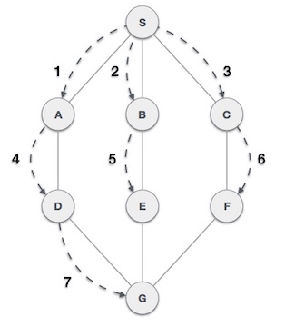

- ## Pseudocode


- ## Illustration

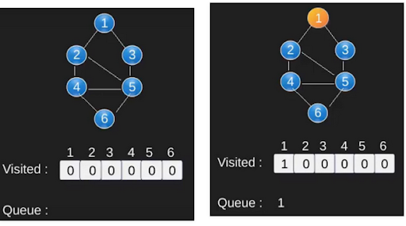
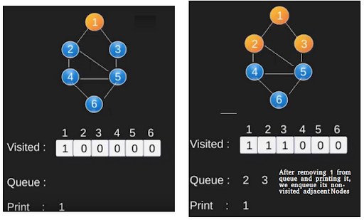
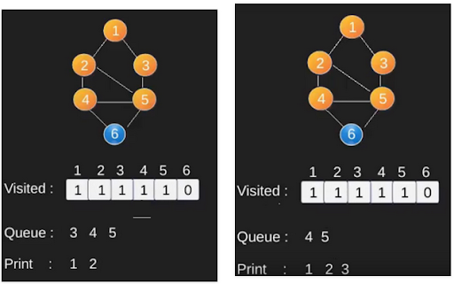
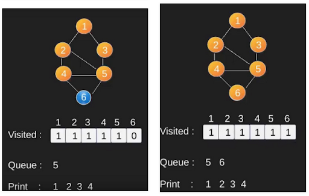
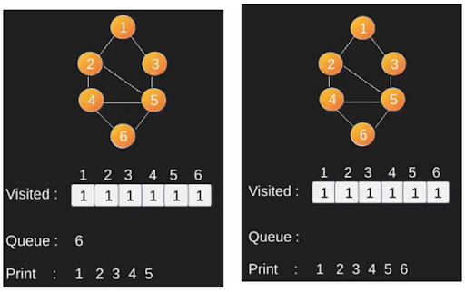

- ## BFS Implementation

    ```C
    void Graph::BFS(int s) 
    { 
        // Mark all the vertices as not visited 
        bool *visited = new bool[V]; 
        for(int i = 0; i < V; i++) 
            visited[i] = false; 
    
        // Create a queue for BFS 
        list<int> queue; 
    
        // Mark the current node as visited and enqueue it 
        visited[s] = true; 
        queue.push_back(s); 
    
        // 'i' will be used to get all adjacent 
        // vertices of a vertex 
        list<int>::iterator i; 
    
        while(!queue.empty()) 
        { 
            // Dequeue a vertex from queue and print it 
            s = queue.front(); 
            cout << s << " "; 
            queue.pop_front(); 

    
            // Get all adjacent vertices of the dequeued 
            // vertex s. If an adjacent has not been visited,  
            // then mark it visited and enqueue it 
            for (i = adj[s].begin(); i != adj[s].end(); ++i) 
            { 
                if (!visited[*i]) 
                { 
                    visited[*i] = true; 
                    queue.push_back(*i); 
                } 
            } 
        } 
    } 
    ```
    For implementation using *adjacency list*, please make your own, use C++ STL.
     BFS produces the shortest distance from *source* to *destination* when applied to *unweighted graph*.


## Depth First Search

The DFS algorithm is a recursive algorithm that uses the idea of backtracking. Here, the word backtrack means that when you move forward and there are no more nodes along the current path, then you will move backwards on the same path to find nodes to traverse. All nodes will be visited on the current path until all nodes that have not been visited have been traversed after which the next path will be selected. DFS uses stack / recursive in its use.

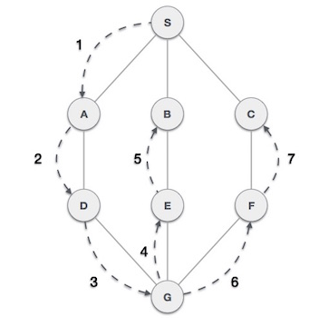

- ## Pseudocode

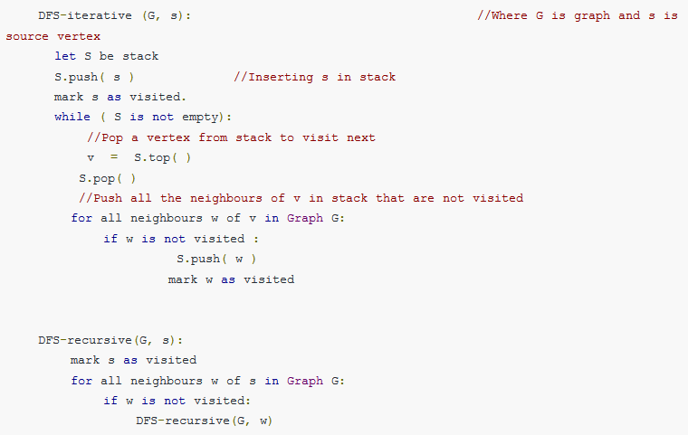

- ## Illustration

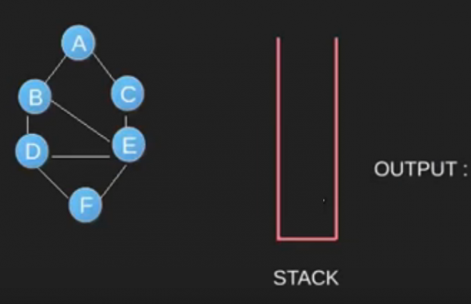
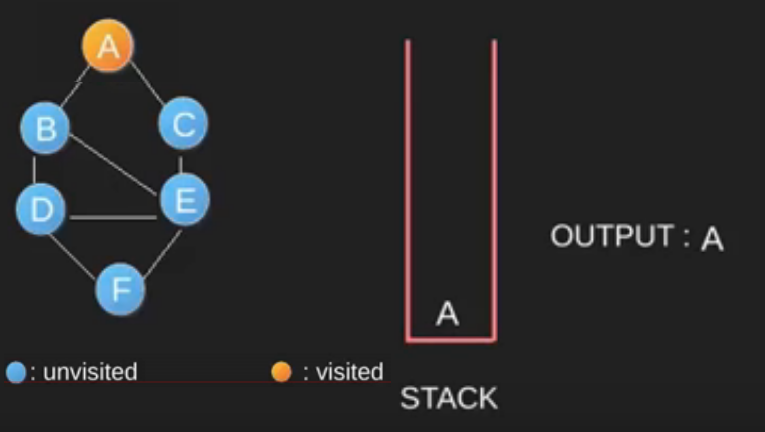
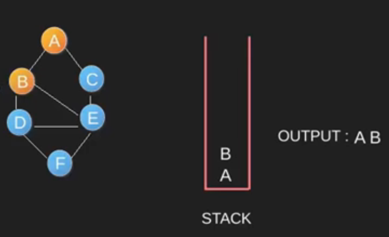
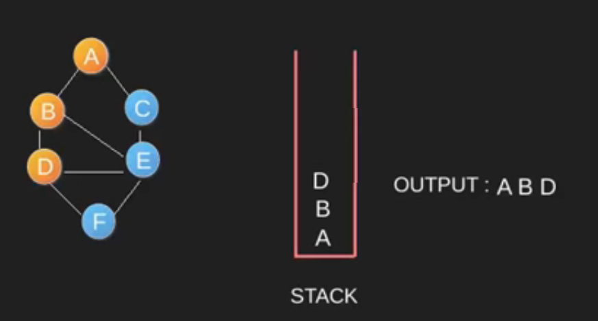
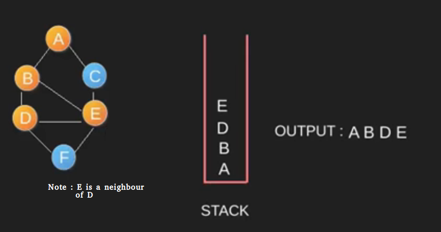
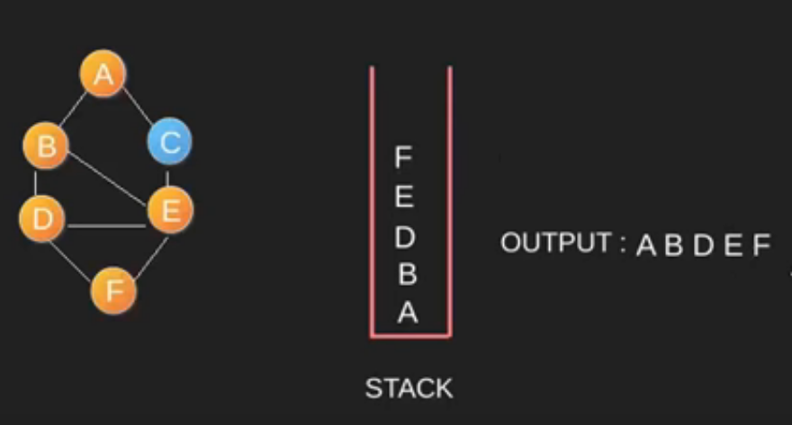
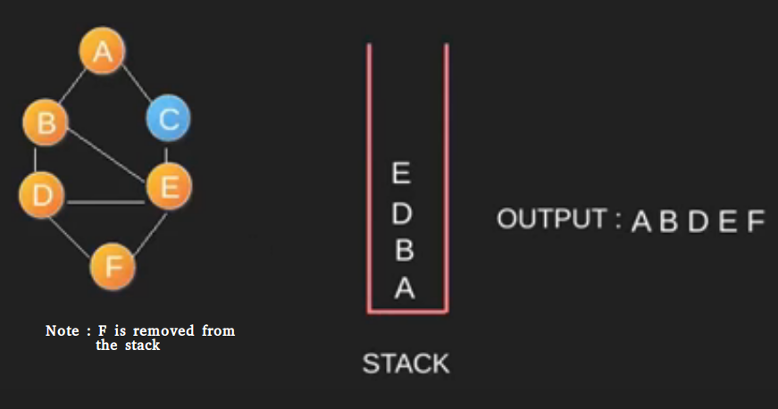
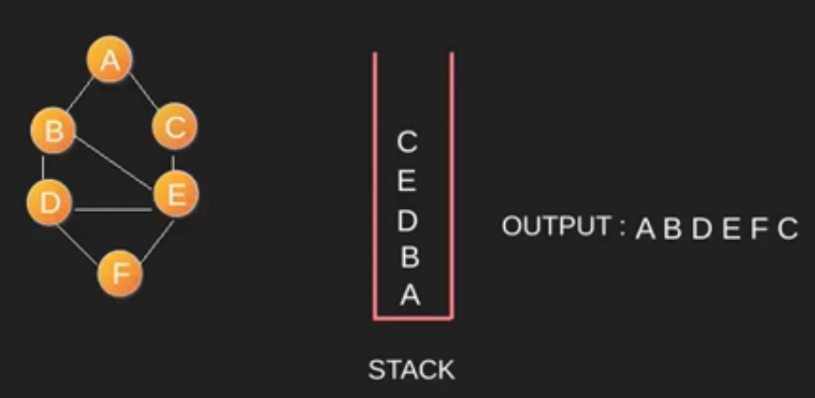
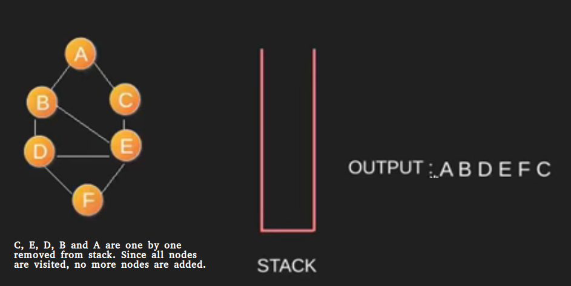

- ## DFS Implementation

    ```C
    void Graph::DFSUtil(int v, bool visited[]) 
    { 
        // Mark the current node as visited and 
        // print it 
        visited[v] = true; 
        cout << v << " "; 
    
        // Recur for all the vertices adjacent 
        // to this vertex 
        list<int>::iterator i; 
        for (i = adj[v].begin(); i != adj[v].end(); ++i) 
            if (!visited[*i]) 
                DFSUtil(*i, visited); 
    } 
    
    // DFS traversal of the vertices reachable from v. 
    // It uses recursive DFSUtil() 
    void Graph::DFS(int v) 
    { 
        // Mark all the vertices as not visited 
        bool *visited = new bool[V]; 
        for (int i = 0; i < V; i++) 
            visited[i] = false; 
        
        // Call the recursive helper function 
        // to print DFS traversal 
        DFSUtil(v, visited); 
    } 
    ```
    For implementation using *adjacency list*, please make your own, use C++ STL.
     DFS does not always produce the shortest distance from *source* to *destination* when applied to *graph*.